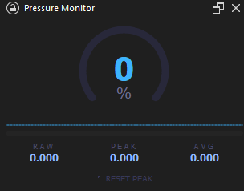

# Pressure Monitor — Krita Plugin

A Krita docker that displays real-time stylus pressure with a circular gauge, sparkline history, peak marker, and live statistics.



## Features

- **Circular gauge** — color-coded arc from blue (light) through purple to red (heavy)
- **Sparkline** — scrolling pressure history at the bottom of the gauge
- **Peak marker** — yellow dot on the arc showing the highest pressure in the current session
- **Live bar** — thin gradient bar below the gauge for at-a-glance feedback
- **Stats cards** — RAW (current), PEAK (session max), AVG (active strokes only)
- **Smooth decay** — gauge fades out gradually when the pen is lifted instead of snapping to zero
- **Dark UI** — panel styled for Krita's default dark theme

## Requirements

- Krita 5.x (tested on 5.2+)
- Python plugin support enabled in Krita

## Installation

**From the web (easiest):**

1. In Krita: **Tools → Scripts → Import Python Plugin from Web…**
2. Paste `https://github.com/masioware/krita-pressure-monitor` and confirm
3. Restart Krita
4. **Settings → Configure Krita → Python Plugin Manager** → enable **Pressure Monitor**
5. Restart Krita again
6. **Settings → Dockers → Pressure Monitor** to show the panel

**From a ZIP file:**

1. Build the ZIP: `python scripts/build.py`
2. In Krita: **Tools → Scripts → Import Python Plugin…** → select `pressure_monitor.zip`
3. Follow steps 3–6 above

## Build

```bash
python scripts/build.py
```

This creates `pressure_monitor.zip` with the correct structure for Krita's plugin importer. Using `zip` directly from Linux may omit the explicit directory entry that Krita's Windows importer requires.

## Usage

| Element | Description |
|---|---|
| Arc | Fills clockwise as pressure increases |
| Yellow dot | Peak pressure reached this session |
| RAW | Raw pressure value (0.000 – 1.000) at this instant |
| PEAK | Highest pressure recorded since last reset |
| AVG | Rolling average of the last 80 active samples (pen-down only) |
| ↺ RESET PEAK | Clears the peak marker and resets the AVG history |

## How pressure is read

Krita's Python API does not expose pen pressure directly. This plugin installs a `QTabletEvent` filter on the application and reads `event.pressure()` (range 0.0 – 1.0) from `TabletPress`, `TabletMove`, and `TabletRelease` events. The filter never blocks events — it only observes them.
